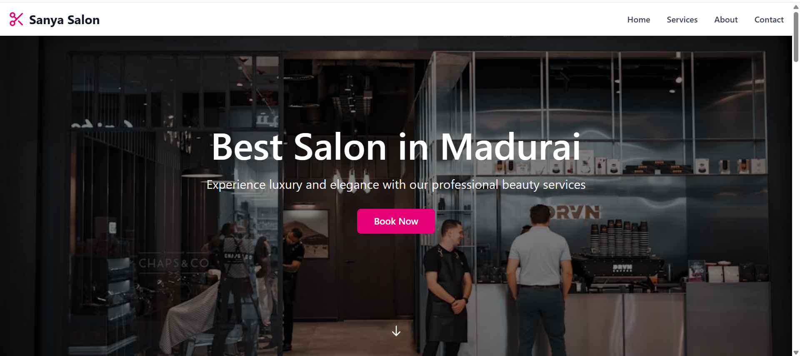

# FUTURE_UIUX_01
UI/UX Internship Task-Sanya Salon Website Design
# Sanya Salon UI/UX Design

## 📌 Project Overview
This project is a UI/UX design for a salon website created as part of the Future Interns Internship Program. The goal of this project is to design a modern, user-friendly, and conversion-focused website.

## 🎯 Objective
- Create a clean and professional salon website
- Improve user experience and navigation
- Design a layout that encourages users to book services

## 🖥️ Features
- Responsive design (Desktop & Mobile)
- Clean navigation bar
- Attractive banner section
- Service sections (Haircut, Facial, Spa)
- Call-to-action button (Book Now)
- Contact section

## 🛠️ Tools Used
- Figma (UI Design)
- GitHub (Project hosting)

## 📱 Screenshots

### Desktop View

### Mobile View

## 📍 Conclusion
This project helped in understanding UI/UX principles, layout design, and user-centered design thinking.

---

✨ Designed by Sanya
